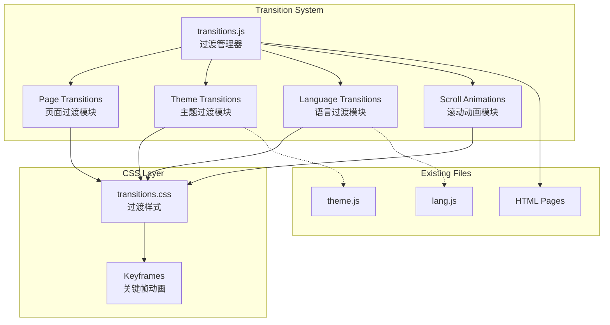

# Design Document: Smooth Transitions

## Overview

本设计文档描述了个人作品集网站页面切换和交互过渡优化的技术实现方案。核心目标是通过现代化的 CSS 过渡动画和 JavaScript API 来提升用户体验，使页面导航、主题切换、语言切换等交互更加丝滑流畅。

设计遵循渐进增强原则，在支持新特性的浏览器中提供最佳体验，同时确保在旧浏览器中功能正常运行。

## Architecture

系统采用模块化架构，将过渡效果分为独立的功能模块：



## Components and Interfaces

### 1. 过渡管理器 (TransitionManager)

核心协调模块，负责初始化和管理所有过渡效果。

```javascript
// js/transitions.js
const TransitionManager = {
    config: {
        pageTransitionDuration: 300,
        themeTransitionDuration: 200,
        langTransitionDuration: 150,
        scrollAnimationDuration: 400,
        scrollAnimationDelay: 50,
        respectReducedMotion: true
    },
    
    // 检测用户是否偏好减少动画
    prefersReducedMotion() {
        return window.matchMedia('(prefers-color-scheme: reduce)').matches;
    },
    
    // 初始化所有过渡模块
    init() {
        if (this.config.respectReducedMotion && this.prefersReducedMotion()) {
            return; // 跳过动画初始化
        }
        PageTransitions.init();
        ThemeTransitions.init();
        LanguageTransitions.init();
        ScrollAnimations.init();
        ImageTransitions.init();
    }
};
```

### 2. 页面过渡模块 (PageTransitions)

使用 View Transitions API 实现页面间的平滑过渡。

```javascript
const PageTransitions = {
    isTransitioning: false,
    
    init() {
        this.bindNavigationLinks();
        this.handlePopState();
    },
    
    // 绑定所有站内导航链接
    bindNavigationLinks() {
        document.querySelectorAll('a[href^="/"]').forEach(link => {
            link.addEventListener('click', (e) => this.handleNavigation(e, link));
        });
    },
    
    // 处理导航点击
    async handleNavigation(event, link) {
        const href = link.getAttribute('href');
        
        // 跳过外部链接和锚点链接
        if (href.startsWith('#') || href.startsWith('http')) return;
        
        // 防止重复点击
        if (this.isTransitioning) {
            event.preventDefault();
            return;
        }
        
        // 检查浏览器支持
        if (!document.startViewTransition) {
            return; // 降级为默认导航
        }
        
        event.preventDefault();
        this.isTransitioning = true;
        
        try {
            await this.performTransition(href);
        } finally {
            this.isTransitioning = false;
        }
    },
    
    // 执行页面过渡
    async performTransition(href) {
        const transition = document.startViewTransition(async () => {
            const response = await fetch(href);
            const html = await response.text();
            const parser = new DOMParser();
            const doc = parser.parseFromString(html, 'text/html');
            
            // 更新页面内容
            document.title = doc.title;
            document.body.innerHTML = doc.body.innerHTML;
            
            // 重新初始化脚本
            this.reinitializeScripts();
        });
        
        await transition.finished;
        history.pushState({}, '', href);
    },
    
    // 处理浏览器前进/后退
    handlePopState() {
        window.addEventListener('popstate', async () => {
            if (document.startViewTransition) {
                await this.performTransition(location.href);
            } else {
                location.reload();
            }
        });
    },
    
    // 重新初始化页面脚本
    reinitializeScripts() {
        // 重新绑定主题切换
        if (window.ThemeTransitions) ThemeTransitions.init();
        // 重新绑定语言切换
        if (window.YuiLang) window.YuiLang.applyTranslations(window.YuiLang.getCurrentLang());
        // 重新绑定滚动动画
        if (window.ScrollAnimations) ScrollAnimations.init();
        // 重新绑定导航链接
        this.bindNavigationLinks();
    }
};
```

### 3. 主题过渡模块 (ThemeTransitions)

增强主题切换效果，添加圆形扩散动画。

```javascript
const ThemeTransitions = {
    init() {
        this.enhanceThemeToggle();
    },
    
    enhanceThemeToggle() {
        const toggleBtn = document.getElementById('themeToggle');
        if (!toggleBtn) return;
        
        // 移除原有事件监听器，添加增强版本
        const newBtn = toggleBtn.cloneNode(true);
        toggleBtn.parentNode.replaceChild(newBtn, toggleBtn);
        
        newBtn.addEventListener('click', (e) => this.handleThemeToggle(e, newBtn));
    },
    
    async handleThemeToggle(event, button) {
        const rect = button.getBoundingClientRect();
        const x = rect.left + rect.width / 2;
        const y = rect.top + rect.height / 2;
        
        // 计算扩散半径
        const endRadius = Math.hypot(
            Math.max(x, window.innerWidth - x),
            Math.max(y, window.innerHeight - y)
        );
        
        const isDark = document.documentElement.classList.contains('dark');
        
        // 使用 View Transitions API 实现圆形扩散
        if (document.startViewTransition) {
            const transition = document.startViewTransition(() => {
                document.documentElement.classList.toggle('dark');
                this.updateIcon(!isDark);
                localStorage.setItem('yui-portfolio-theme', isDark ? 'light' : 'dark');
            });
            
            // 设置圆形裁剪动画
            transition.ready.then(() => {
                document.documentElement.animate(
                    {
                        clipPath: [
                            `circle(0px at ${x}px ${y}px)`,
                            `circle(${endRadius}px at ${x}px ${y}px)`
                        ]
                    },
                    {
                        duration: 400,
                        easing: 'ease-out',
                        pseudoElement: '::view-transition-new(root)'
                    }
                );
            });
        } else {
            // 降级方案：简单切换
            document.documentElement.classList.toggle('dark');
            this.updateIcon(!isDark);
            localStorage.setItem('yui-portfolio-theme', isDark ? 'light' : 'dark');
        }
    },
    
    updateIcon(isDark) {
        const icon = document.querySelector('#themeToggle .material-symbols-outlined');
        if (icon) {
            icon.textContent = isDark ? 'light_mode' : 'dark_mode';
        }
    }
};
```

### 4. 语言过渡模块 (LanguageTransitions)

为语言切换添加文字淡入淡出效果。

```javascript
const LanguageTransitions = {
    init() {
        this.enhanceLanguageToggle();
    },
    
    enhanceLanguageToggle() {
        const toggleBtn = document.getElementById('langToggle');
        if (!toggleBtn) return;
        
        // 监听语言变化事件
        window.addEventListener('languageChanged', (e) => {
            this.animateTextChange();
        });
    },
    
    animateTextChange() {
        const elements = document.querySelectorAll('[data-i18n]');
        
        elements.forEach((el, index) => {
            el.style.opacity = '0';
            el.style.transform = 'translateY(5px)';
            
            setTimeout(() => {
                el.style.transition = 'opacity 150ms ease-out, transform 150ms ease-out';
                el.style.opacity = '1';
                el.style.transform = 'translateY(0)';
            }, 50 + index * 10); // 错开动画时间
        });
    }
};
```

### 5. 滚动动画模块 (ScrollAnimations)

使用 Intersection Observer 实现滚动触发的入场动画。

```javascript
const ScrollAnimations = {
    observer: null,
    
    init() {
        this.setupObserver();
        this.observeElements();
    },
    
    setupObserver() {
        this.observer = new IntersectionObserver(
            (entries) => this.handleIntersection(entries),
            {
                threshold: 0.1,
                rootMargin: '0px 0px -50px 0px'
            }
        );
    },
    
    observeElements() {
        // 选择需要动画的元素
        const selectors = [
            '.gallery-item',
            '.timeline-item',
            'section > div',
            '.grid > div'
        ];
        
        document.querySelectorAll(selectors.join(', ')).forEach(el => {
            if (!el.classList.contains('scroll-animated')) {
                el.classList.add('scroll-animate');
                this.observer.observe(el);
            }
        });
    },
    
    handleIntersection(entries) {
        entries.forEach((entry, index) => {
            if (entry.isIntersecting) {
                setTimeout(() => {
                    entry.target.classList.add('scroll-animated');
                    entry.target.classList.remove('scroll-animate');
                }, index * 50); // 错开动画
                
                this.observer.unobserve(entry.target);
            }
        });
    }
};
```

### 6. 图片过渡模块 (ImageTransitions)

处理图片加载的平滑过渡。

```javascript
const ImageTransitions = {
    init() {
        this.observeImages();
    },
    
    observeImages() {
        document.querySelectorAll('img:not(.img-loaded)').forEach(img => {
            if (img.complete) {
                img.classList.add('img-loaded');
            } else {
                img.classList.add('img-loading');
                img.addEventListener('load', () => this.handleImageLoad(img));
                img.addEventListener('error', () => this.handleImageError(img));
            }
        });
    },
    
    handleImageLoad(img) {
        img.classList.remove('img-loading');
        img.classList.add('img-loaded');
    },
    
    handleImageError(img) {
        img.classList.remove('img-loading');
        img.classList.add('img-error');
    }
};
```

## Data Models

本功能主要涉及配置数据和状态管理：

### 配置模型

```javascript
interface TransitionConfig {
    pageTransitionDuration: number;    // 页面过渡时长 (ms)
    themeTransitionDuration: number;   // 主题过渡时长 (ms)
    langTransitionDuration: number;    // 语言过渡时长 (ms)
    scrollAnimationDuration: number;   // 滚动动画时长 (ms)
    scrollAnimationDelay: number;      // 滚动动画间隔 (ms)
    respectReducedMotion: boolean;     // 是否尊重用户动画偏好
}
```

### 状态模型

```javascript
interface TransitionState {
    isPageTransitioning: boolean;      // 页面是否正在过渡
    isThemeTransitioning: boolean;     // 主题是否正在过渡
    currentTheme: 'light' | 'dark';    // 当前主题
    currentLang: 'zh' | 'en';          // 当前语言
}
```


## Correctness Properties

*A property is a characteristic or behavior that should hold true across all valid executions of a system—essentially, a formal statement about what the system should do. Properties serve as the bridge between human-readable specifications and machine-verifiable correctness guarantees.*

### Property 1: 页面导航过渡正确性

*For any* 站内导航链接点击事件，如果浏览器支持 View Transitions API，则应触发过渡动画；如果不支持，则应优雅降级为传统导航方式，且页面内容应正确更新。

**Validates: Requirements 1.1, 1.3**

### Property 2: 导航防重复点击

*For any* 页面过渡期间的导航链接点击事件，系统应阻止该点击事件，确保同一时间只有一个过渡动画在执行。

**Validates: Requirements 1.4**

### Property 3: 主题切换动画触发

*For any* 主题切换按钮点击事件，系统应切换主题状态（dark/light），并在支持 View Transitions API 的浏览器中触发圆形扩散动画。

**Validates: Requirements 2.1, 2.3**

### Property 4: 主题快速切换处理

*For any* 连续的主题切换点击事件序列，最终主题状态应与点击次数的奇偶性一致（奇数次切换到相反主题，偶数次保持原主题）。

**Validates: Requirements 2.4**

### Property 5: 语言切换布局稳定性

*For any* 语言切换操作，页面中带有 data-i18n 属性的元素位置应在切换前后保持稳定（允许文字内容变化导致的微小偏移）。

**Validates: Requirements 3.1, 3.3**

### Property 6: 滚动动画触发与延迟

*For any* 进入视口的元素集合，每个元素应按顺序触发入场动画，且相邻元素的动画触发时间差应为配置的延迟值（50ms）。

**Validates: Requirements 5.1, 5.3**

### Property 7: 减少动画偏好尊重

*For any* 启用了 prefers-reduced-motion 偏好的用户环境，系统应跳过所有动画效果，直接显示最终状态。

**Validates: Requirements 5.4**

### Property 8: 图片加载状态管理

*For any* 页面中的图片元素，在加载过程中应具有 img-loading 类，加载完成后应具有 img-loaded 类，加载失败后应具有 img-error 类，且这三个状态互斥。

**Validates: Requirements 6.1, 6.2, 6.3**

## Error Handling

### 1. View Transitions API 不支持

当浏览器不支持 View Transitions API 时：
- 页面导航降级为传统的整页刷新
- 主题切换降级为简单的类切换，依赖 CSS transition 属性
- 不显示任何错误信息，用户无感知

```javascript
if (!document.startViewTransition) {
    // 降级处理
    return defaultBehavior();
}
```

### 2. 页面加载失败

当 fetch 请求失败时：
- 捕获异常并回退到传统导航
- 记录错误到控制台供调试

```javascript
try {
    const response = await fetch(href);
    if (!response.ok) throw new Error('Page load failed');
    // ...
} catch (error) {
    console.error('Page transition failed:', error);
    window.location.href = href; // 回退到传统导航
}
```

### 3. 图片加载失败

当图片加载失败时：
- 添加 img-error 类
- 保持占位背景
- 可选：显示错误图标或替代文字

### 4. 动画冲突

当多个动画同时触发时：
- 使用 isTransitioning 标志防止页面过渡冲突
- 主题切换使用 View Transitions API 的内置队列机制
- 滚动动画使用 unobserve 防止重复触发

## Testing Strategy

### 单元测试

使用 Jest 进行单元测试，覆盖以下场景：

1. **配置验证测试**
   - 验证所有过渡时长配置值正确
   - 验证默认配置符合需求规格

2. **状态管理测试**
   - 测试 isTransitioning 标志的正确设置和重置
   - 测试主题状态的正确切换

3. **降级逻辑测试**
   - 模拟不支持 View Transitions API 的环境
   - 验证降级行为正确

### 属性测试

使用 fast-check 进行属性测试，每个测试运行至少 100 次迭代：

1. **Property 1 测试**: 页面导航过渡正确性
   - 生成随机的导航链接 href
   - 验证过渡行为符合预期

2. **Property 2 测试**: 导航防重复点击
   - 生成随机的点击事件序列
   - 验证过渡期间的点击被正确阻止

3. **Property 4 测试**: 主题快速切换处理
   - 生成随机长度的点击序列
   - 验证最终状态与点击次数奇偶性一致

4. **Property 6 测试**: 滚动动画触发与延迟
   - 生成随机数量的元素
   - 验证动画触发时间差符合配置

5. **Property 8 测试**: 图片加载状态管理
   - 生成随机的图片加载事件序列
   - 验证状态类的互斥性

### 集成测试

使用 Playwright 进行端到端测试：

1. **页面导航测试**
   - 测试各页面间的导航过渡
   - 测试浏览器前进/后退按钮

2. **主题切换测试**
   - 测试主题切换的视觉效果
   - 测试主题持久化

3. **语言切换测试**
   - 测试语言切换的文字变化
   - 测试布局稳定性

4. **滚动动画测试**
   - 测试元素进入视口时的动画
   - 测试 prefers-reduced-motion 偏好

### 测试配置

```javascript
// jest.config.js
module.exports = {
    testEnvironment: 'jsdom',
    setupFilesAfterEnv: ['./tests/setup.js'],
    testMatch: ['**/*.test.js', '**/*.property.test.js']
};
```

```javascript
// fast-check 配置
fc.configureGlobal({
    numRuns: 100,
    verbose: true
});
```

## CSS Styles

### transitions.css

```css
/* 页面过渡动画 */
::view-transition-old(root),
::view-transition-new(root) {
    animation-duration: 300ms;
    animation-timing-function: ease-out;
}

::view-transition-old(root) {
    animation-name: fade-out;
}

::view-transition-new(root) {
    animation-name: fade-in;
}

@keyframes fade-out {
    from { opacity: 1; }
    to { opacity: 0; }
}

@keyframes fade-in {
    from { opacity: 0; }
    to { opacity: 1; }
}

/* 主题过渡 - 禁用默认动画以使用自定义圆形扩散 */
::view-transition-old(root),
::view-transition-new(root) {
    animation: none;
    mix-blend-mode: normal;
}

/* 滚动动画 */
.scroll-animate {
    opacity: 0;
    transform: translateY(20px);
}

.scroll-animated {
    opacity: 1;
    transform: translateY(0);
    transition: opacity 400ms ease-out, transform 400ms ease-out;
}

/* 图片加载状态 */
.img-loading {
    opacity: 0;
    background-color: #f0f0f0;
}

.img-loaded {
    opacity: 1;
    transition: opacity 300ms ease-out;
}

.img-error {
    opacity: 0.5;
    background-color: #f0f0f0;
}

/* 导航链接悬停效果 */
nav a {
    position: relative;
}

nav a::after {
    content: '';
    position: absolute;
    bottom: -2px;
    left: 0;
    width: 0;
    height: 1px;
    background-color: currentColor;
    transition: width 200ms ease-out;
}

nav a:hover::after {
    width: 100%;
}

/* 按钮点击效果 */
.btn-primary,
.btn-secondary {
    transition: transform 100ms ease-out, background-color 200ms ease-out, box-shadow 200ms ease-out;
}

.btn-primary:active,
.btn-secondary:active {
    transform: scale(0.98);
}

/* 尊重用户动画偏好 */
@media (prefers-reduced-motion: reduce) {
    *,
    *::before,
    *::after {
        animation-duration: 0.01ms !important;
        animation-iteration-count: 1 !important;
        transition-duration: 0.01ms !important;
    }
    
    .scroll-animate {
        opacity: 1;
        transform: none;
    }
}

/* 语言切换过渡 */
[data-i18n] {
    transition: opacity 150ms ease-out, transform 150ms ease-out;
}
```

## File Structure

```
js/
├── theme.js          # 现有文件（保留，但主题切换逻辑将被增强）
├── lang.js           # 现有文件（保留，添加动画事件触发）
└── transitions.js    # 新文件：过渡管理器和所有过渡模块

css/
└── transitions.css   # 新文件：所有过渡相关的 CSS 样式

tests/
├── setup.js                    # 测试环境配置
├── transitions.test.js         # 单元测试
├── transitions.property.test.js # 属性测试
└── e2e/
    └── transitions.spec.js     # 端到端测试
```
