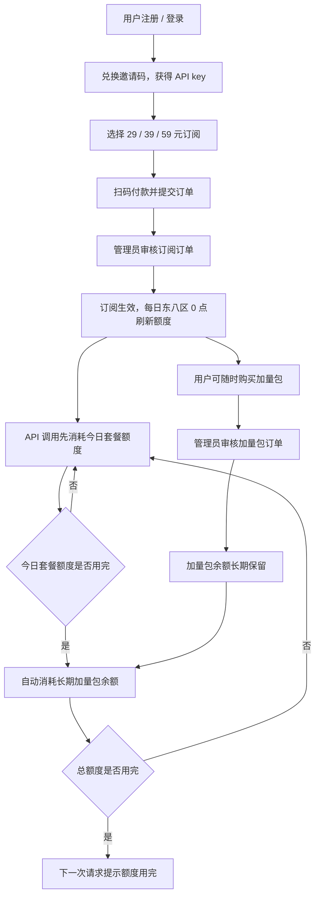

# 订阅池 Account / Admin 页面与长期加量包设计

## 背景

- 分支：`codex/subscription-pool-pricing-design`。
- 本文覆盖并修正此前设计里“加量包当日有效、不结转”的口径。
- 最新规则：加量包未用完可长期保留；续费、换套餐后继续保留；每日套餐额度优先消耗，只有每日额度用完后才自动消耗加量包。
- 加量包是订阅池的补充额度，不是新的按量余额。没有有效订阅时，加量包余额保留但不放行 API；续费后继续可用。

## 官方价格口径

OpenAI 官方 API Pricing 页面在 2026-06-16 可见 `gpt-5.4` / `gpt-5.5` 的标准价格，并包含 short / long context 两组价格。

本项目第一版只做一种用户计费模式，不在 Account / Admin 里给用户暴露“上下文档位”或“Batch / Flex / Priority”等选项。原因：

- 当前 usage event 只可靠提供 `cache_hit_input_tokens`、`cache_miss_input_tokens`、`output_tokens`，没有稳定的 `context_tier` 字段。
- 用户侧要的是订阅池额度，不是让用户选择多种 API 计费模式。
- Codex 是否压缩上下文不是 yui.web 的账务事实；yui.web 只按最终 usage event 扣额度。

因此第一版项目计价采用用户已确认的单一价格表，作为 `openai-standard-short-usd-20260616` 价格版本：

| 模型 | 输入 Token | 命中缓存输入 | 输出 Token |
| --- | ---: | ---: | ---: |
| `gpt-5.4` | $2.50 / 100 万 | $0.25 / 100 万 | $15.00 / 100 万 |
| `gpt-5.5` | $5.00 / 100 万 | $0.50 / 100 万 | $30.00 / 100 万 |

如果以后上游 usage 明确回传 long context 或官方账单成本明显偏离，再新增价格版本，不回写历史记录。

## 订阅与加量包规则

### 套餐

| 套餐 | 月费 | 每日美元额度 | 可用模型 |
| --- | ---: | ---: | --- |
| 29 元订阅池 | 29 元 / 30 天 | $19 / 天 | `gpt-5.4`、`gpt-5.5` |
| 39 元订阅池 | 39 元 / 30 天 | $29 / 天 | `gpt-5.4`、`gpt-5.5` |
| 59 元订阅池 | 59 元 / 30 天 | $49 / 天 | `gpt-5.4`、`gpt-5.5` |

每日额度按东八区 0 点刷新。当天未使用完的套餐额度不累计。

### 加量包

| 加量包 | 支付金额 | 增加美元额度 | 有效期 |
| --- | ---: | ---: | --- |
| 5 美元加量包 | 5 元 | $5 | 长期保留 |
| 10 美元加量包 | 10 元 | $10 | 长期保留 |
| 20 美元加量包 | 20 元 | $20 | 长期保留 |
| 50 美元加量包 | 50 元 | $50 | 长期保留 |

加量包余额存为独立 USD micros 余额，不能写入 `account_balances.balance_nanos`。续费或换套餐不清零加量包余额。

## 扣费顺序

每次 usage 产生美元扣费金额后，按以下顺序扣：

1. 先扣当天套餐额度剩余值。
2. 当天套餐额度扣到 0 后，才扣长期加量包余额。
3. 如果套餐剩余 + 加量包余额仍不足，本次请求已经完成，记录 `overrun_usd_micros`，下一次状态检查拒绝。

请求前放行规则：

- API key 未托管、未兑换、禁用：拒绝。
- 无有效订阅：拒绝，哪怕还有加量包余额也只保留不使用。
- 有有效订阅且“今日套餐剩余额度 + 加量包余额”大于 0：允许本次请求。
- 两者都为 0：拒绝，提示今日额度已用完，可购买加量包或等待东八区 0 点刷新。

关键口径：只要今日套餐额度还有剩余，加量包余额不减少。

## 数据模型修正

此前计划里的 `account_quota_addons.quota_date` 或“当日加量包”表不再采用。

新增或保留以下表语义：

### `subscription_orders`

- 统一承载订阅订单和加量包订单。
- `order_type` 使用 `subscription` / `addon`，不要使用暗示当日有效的 `quota_addon`。
- 订阅订单审核通过后写入或延长 `account_subscriptions`。
- 加量包订单审核通过后增加 `account_addon_balances.balance_usd_micros`。

### `account_addon_balances`

- `phone TEXT PRIMARY KEY`
- `balance_usd_micros INTEGER NOT NULL DEFAULT 0`
- `updated_at TEXT NOT NULL`

这是长期备用美元余额，只能由加量包入账、API 扣费、管理员调整、退款变更。

### `account_addon_ledger_entries`

- 记录加量包余额变动。
- `entry_type` 建议为 `addon_purchase`、`api_charge`、`admin_adjustment`、`refund`。
- 每条 API 扣费只在实际消耗加量包时写入负数流水。

### `api_usd_charge_records`

建议增加扣费来源拆分字段：

- `daily_quota_before_usd_micros`
- `daily_quota_deducted_usd_micros`
- `daily_quota_after_usd_micros`
- `addon_balance_before_usd_micros`
- `addon_deducted_usd_micros`
- `addon_balance_after_usd_micros`
- `overrun_usd_micros`
- `quota_date`
- `official_price_version`

Admin 的用量分析必须按这些字段展示“扣每日额度 / 扣加量包 / 超额成本”，不能只展示一个总金额。

## 用户 Account 页面设计

Account 页面第一屏只服务用户最常见的三个问题：还能不能用、怎么买、API key 在哪。

### 1. 顶部账户状态

保留当前手机号和退出登录。新增一组状态卡：

- 当前套餐：套餐名、到期时间、是否有效。
- 今日套餐额度：总额、已用、剩余、东八区下一次刷新时间。
- 加量包余额：长期保留余额。
- 当前可用额度：今日剩余额度 + 加量包余额。

状态文案按场景：

- 正常：显示“可用”。
- 今日套餐额度用完但加量包还有余额：显示“正在使用加量包”。
- 套餐过期：显示“订阅已到期，加量包余额已保留，续费后继续可用”。
- 额度归零：显示“额度已用完”。

### 2. 购买套餐

展示三张套餐卡：

- 29 元 / 30 天，每日 $19。
- 39 元 / 30 天，每日 $29。
- 59 元 / 30 天，每日 $49。

三张卡都显示同样的模型权限：`gpt-5.4` 和 `gpt-5.5`。不要暗示高档套餐解锁更多模型。

购买流程：

1. 用户选择套餐。
2. 页面展示支付宝 / 微信收款码。
3. 用户付款后提交订单，选择支付方式，可填写备注。
4. 订单进入“待确认”。
5. 管理员在 Admin 审核通过。
6. 审核通过后订阅生效；已有有效订阅时，从 `max(当前到期时间, 当前时间)` 延长 30 天，套餐切换为新订单套餐。

### 3. 购买加量包

展示 5 / 10 / 20 / 50 元四个加量包。

购买流程与套餐一致：付款、提交订单、管理员确认、入账到长期加量包余额。

页面必须明确展示“加量包长期保留，只有今日套餐额度用完后才会消耗”。实现时可用短说明，但不要写成大段教程。

### 4. API key

保留现有“邀请码兑换 API key”和“复制完整 API key”逻辑。

Account 中 API key 卡片只展示：

- API key preview / reveal 后完整 key。
- 兑换时间。
- 复制按钮。
- 当前 key 状态：可用、订阅到期、额度用完、禁用。

不要在 API key 卡片里重复展示订单金额、手机号、旧人民币余额或 31 天旧文案。

### 5. 模型价格

模型总览改为美元官方价格表：

- `gpt-5.4` 输入 / 命中缓存输入 / 输出。
- `gpt-5.5` 输入 / 命中缓存输入 / 输出。

只展示一套项目价格，不展示上下文档位、Batch、Flex、Priority。

### 6. 用量与流水

用量区展示：

- 今日 token 用量：缓存命中输入、缓存未命中输入、输出、reasoning。
- 今日美元消耗：总消耗、扣每日额度、扣加量包、超额成本。
- 最近 API 扣费记录：时间、模型、token 构成、美元扣费、扣费来源、扣后状态。
- 加量包流水：购买入账、API 消耗、管理员调整。
- 订阅 / 加量包订单：待确认、已确认、已拒绝。

扣费流水默认折叠，避免 Account 页面过重。

## 管理员 Admin 页面设计

Admin 页面不再围绕“充值余额”组织，而是围绕“订单、额度、用量、风险”组织。

### 1. 顶部总览

总览卡片建议展示：

- 今日订单收入：订阅 + 加量包人民币收入。
- 本月订单收入：订阅 + 加量包人民币收入。
- 待审核订单数：订阅订单、加量包订单。
- 有效订阅用户数。
- 今日官方美元消耗。
- 今日加量包消耗。
- 当前加量包余额总额。
- 今日额度用尽用户数。

人民币收入来自订单审核，不来自 token 扣费；美元消耗来自 usage 计价。

### 2. 业务办理

保留现有能力：

- 生成邀请码。
- 生成密码重置码。
- 补充 API key 池。

替换旧“充值审核”为“订单审核”，并分成两个筛选：

- 订阅订单：显示手机号、套餐、金额、提交时间、支付方式、备注、状态、确认 / 拒绝操作。
- 加量包订单：显示手机号、加量包金额、增加美元额度、提交时间、支付方式、备注、状态、确认 / 拒绝操作。

审核通过的副作用：

- 订阅订单：创建或延长订阅，不修改加量包余额。
- 加量包订单：增加长期加量包余额，不修改订阅到期时间。

### 3. 用户额度面板

替换旧“用户余额”语义，展示所有 Shop 用户的订阅池状态：

- 手机号。
- 套餐。
- 订阅到期时间。
- 今日套餐额度。
- 今日已用。
- 今日剩余。
- 加量包余额。
- 当前可用额度。
- API key 状态 / 托管 key 数量。
- 最近使用时间。

筛选项：

- 全部。
- 有效订阅。
- 即将到期。
- 今日额度用完。
- 正在消耗加量包。
- 无有效订阅但有加量包余额。

这个面板是运营视图，不计入收入。

### 4. 用量监控

保留 Shop / Local / 未托管分组，但订阅池收入只统计 Shop 订单。

用量监控展示：

- 今日 / 本月 token 总量。
- 今日 / 本月美元消耗。
- 按模型拆分：`gpt-5.4`、`gpt-5.5`。
- 按 token 类型拆分：命中缓存输入、未命中输入、输出。
- 按扣费来源拆分：每日套餐额度、加量包、超额成本。
- 用户消耗排行：美元消耗、加量包消耗、`gpt-5.5` 占比。

最近扣费记录需要展示 `official_price_version`，方便以后官方价格变化后审计历史。

### 5. 系统工具

保留日志导入，但文案改为“usage 同步 / 补账”。导入后写入 `api_usd_charge_records`，不再写旧人民币 `api_charge_records`。

新增价格快照只读区：

- 当前项目价格版本。
- `gpt-5.4` 价格。
- `gpt-5.5` 价格。
- 生效时间。

## 购买路径总览

## 需要避免的误区

- 不要把加量包写成 `quota_date` 绑定的当日额度。
- 不要续费时清空或重置加量包余额。
- 不要每日 0 点刷新加量包余额。
- 不要在还有今日套餐额度时扣加量包。
- 不要把加量包余额写进人民币 `account_balances`。
- 不要在 Account 页面重新展示旧人民币按量余额主流程。
- 不要把 OpenAI 的 short / long context 做成用户可选的两种计费模式。
